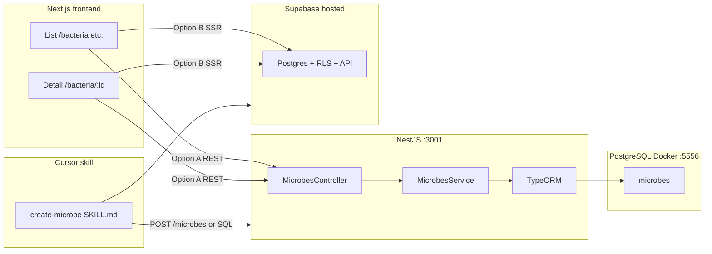

# Zoa Backend and Microbe Pages

## Progress (what is done already)

| Area | Status |
| ---- | ------ |
| **Docker Postgres** | Root [`docker-compose.yml`](../../docker-compose.yml): Postgres 16, `5556:5432`, volume, `zoa` / `zoa_db`. |
| **Monorepo** | Next app in [`frontend/`](../../frontend/); Nest in [`backend/`](../../backend/); root [`package.json`](../../package.json) workspaces; scripts `npm run dev`, `npm run dev:api`, etc. |
| **Supabase (prod data path)** | [`frontend/lib/supabase/`](../../frontend/lib/supabase/), [`frontend/middleware.ts`](../../frontend/middleware.ts), [`frontend/.env.example`](../../frontend/.env.example); see [Supabase data layer](03-supabase-data-layer.md). |
| **Docs / plans** | [`docs/plans/`](./README.md) index + focused plans (branding, monorepo, Supabase). |
| **Shell / nav** | [`frontend/components/layout/`](../../frontend/components/layout/) — Topbar `ZOA`, sidebar **Home** + category links (`/bacteria`, `/parasites`, …). |
| **Nest backend** | TypeORM + Postgres, `MicrobesModule` (`GET /microbes?type=`, `GET /microbes/:id`, `POST /microbes`), global validation, CORS, default port **3001**. |
| **Frontend archive** | `frontend/lib/api.ts`, `frontend/lib/microbe-routes.ts`, dynamic routes `frontend/app/[type]/page.tsx` and `[id]/page.tsx`. |
| **Seed** | `npm run seed:api` → `backend/src/seed.ts` inserts 10 default microbes when the table is empty. |
| **Supabase SQL** | [`docs/supabase/microbes.sql`](../../docs/supabase/microbes.sql) for hosted parity + RLS starter. |
| **Cursor skill** | [`.cursor/skills/create-microbe/SKILL.md`](../../.cursor/skills/create-microbe/SKILL.md). |

---

## Architecture (target)

**Recommendation to unblock pages:** implement **Option B** first (read/write `microbes` in Supabase with RLS) so production matches local env vars on Vercel; keep **Nest + Docker** for optional admin/sync or migrate Nest to use the same Supabase connection string later.

---

## 1. Docker — PostgreSQL on port 5556

Done at repo root (see table above).

---

## 2. NestJS backend (`backend/`)

### Still to do (original plan)

- Add `@nestjs/typeorm`, `typeorm`, `pg`, `class-validator`, `class-transformer`, `@nestjs/config` (optional).
- TypeORM connection to `localhost:5556` (from `.env` in `backend/`).
- CORS for `http://localhost:3000`.
- Listen on **3001** (see [`backend/src/main.ts`](../../backend/src/main.ts) — set `PORT` / default).

### Microbe entity (`backend/src/microbes/microbe.entity.ts`)

Keep the originally specified shape (UUID, name, size, habitat, capabilities, description, `image_urls`, enum `type`, `created_at`).

### API (`MicrobesController`)

| Method | Route | Purpose |
| ------ | ----- | ------- |
| `GET` | `/microbes?type=bacteria` | List by type |
| `GET` | `/microbes/:id` | Detail |
| `POST` | `/microbes` | Create (skill / scripts) |

### Module layout

- `MicrobesModule` + import in `AppModule`.
- Dev: `synchronize: true` acceptable; prod: migrations.

---

## 3. Supabase (production + optional canonical store)

Align with [03-supabase-data-layer.md](03-supabase-data-layer.md).

- Define a **`microbes`** table (or start from a view) matching the same fields as the Nest entity for easy mental model.
- **RLS:** e.g. public read for anon where appropriate; tighten when auth exists.
- **Next pages:** prefer `import { createClient } from "@/lib/supabase/server"` in Server Components for list/detail when Supabase is the source of truth.
- **Secrets:** only anon/publishable key in `NEXT_PUBLIC_*`; `service_role` stays server-only (Nest or Edge if ever needed).

---

## 4. Frontend pages (`frontend/app/`)

Paths are under **`frontend/`** (not repo root `app/`).

### Dynamic routes

- `frontend/app/[type]/page.tsx` — list (validate `type` against allowed set; 404 or redirect if invalid). *(Not created yet.)*
- `frontend/app/[type]/[id]/page.tsx` — detail. *(Not created yet.)*

### Data fetching (pick after `data-source-choice`)

- **REST:** `frontend/lib/api.ts` with `NEXT_PUBLIC_API_URL=http://localhost:3001`.
- **Supabase:** no `api.ts` required for reads; use `await createClient()` and `.from('microbes').select(...)`.

### UI

- Grid cards: first `image_urls` entry, name, size, habitat; link to `/[type]/[id]`.
- Detail: gallery, badge for type, labeled fields, capabilities + description, back to list.
- Theme: existing dark / gold / parchment / scarlet tokens.

---

## 5. Cursor skill — create microbe

Create [`.cursor/skills/create-microbe/SKILL.md`](../../.cursor/skills/create-microbe/SKILL.md):

1. Name (or research) the organism.
2. `WebSearch` for size, habitat, capabilities, description; image URLs where allowed by license.
3. Submit: `curl -X POST` to Nest **or** documented Supabase insert path (service role only on server — prefer Nest POST or Supabase RPC with definer rights if needed).
4. Print confirmation / id.

---

## 6. Seed — 10 microbes (2 per type)

| Type | 1 | 2 |
| ---- | - | - |
| Bacteria | *Escherichia coli* | *Staphylococcus aureus* |
| Fungus | *Aspergillus niger* | *Candida albicans* |
| Virus | Bacteriophage T4 | Influenza A |
| Parasite | *Plasmodium falciparum* | *Toxoplasma gondii* |
| Amoeba | *Amoeba proteus* | *Naegleria fowleri* |

Seed via skill and/or `backend` seed script and/or Supabase SQL seed.

---

## 7. Wiring commands (from repo root)

1. `docker compose up -d` — Postgres.
2. `npm run dev:api` — Nest (after TypeORM is configured).
3. `npm run dev` — Next.
4. Copy [`frontend/.env.example`](../../frontend/.env.example) → `frontend/.env.local` (Supabase + optional `NEXT_PUBLIC_API_URL`).

Document the full matrix in root [`README.md`](../../README.md) once APIs exist.

---

## 8. Execution status

Phases 1–7 above are **implemented** for **local dev** (Nest + Docker + Next). Optional **next evolution**:

1. **Supabase-backed reads** — point list/detail at `createClient()` when `NEXT_PUBLIC_SUPABASE_URL` is set, using the same row shape as `microbes.sql`.
2. **`supabase gen types`** — add `Database` generic to Supabase clients.
3. **Production migrations** — turn off `TYPEORM_SYNC` and ship TypeORM migrations (or retire Nest CRUD if Supabase becomes sole source).
4. **Next “proxy”** — replace deprecated `middleware` convention when upgrading per Next docs.

---

## References in repo

| Topic | Location |
| ----- | -------- |
| Supabase helpers | `frontend/lib/supabase/*` |
| Plans index | [`README.md`](./README.md) |
| Monorepo / deploy notes | [`02-monorepo-deployment.md`](02-monorepo-deployment.md) |
